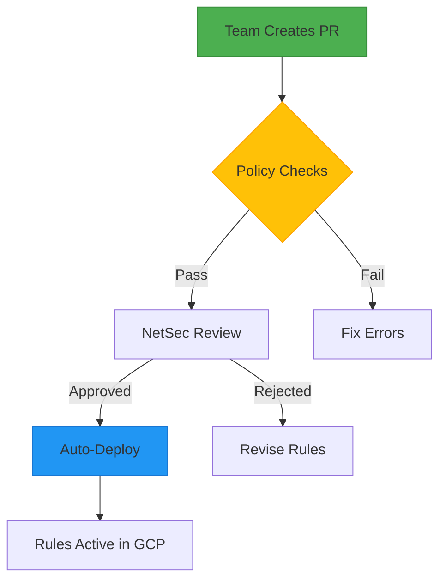
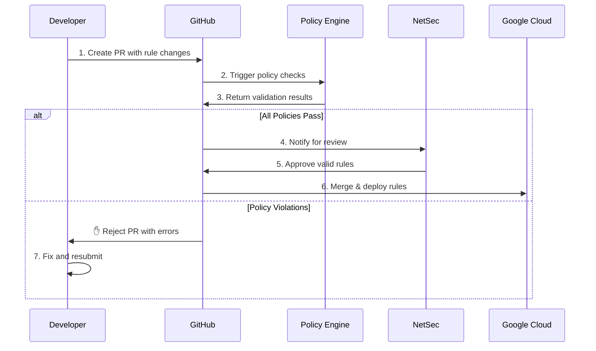

# GCP Firewall Rule Management Portal



## Egress Rules (Outbound Traffic)

### Template Parameters
| Parameter     | Description                | Example               |
|---------------|----------------------------|-----------------------|
| `rule_name`   | Unique identifier          | `egress-postgres`     |
| `to_ranges`   | Destination IP CIDRs       | `["10.100.20.0/24"]` |
| `via_ports`   | Destination Ports          | `[5432]`             |
| `target_tags` | Source VM Tags             | `["app-servers"]`    |
| `priority`    | Rule priority (900-65534)  | `1000`               |

### Implementation
```hcl
# projects/YOUR_PROJECT/egress.tf
module "db_access" {
  source = "../../modules/egress_allow"

  project_id    = "REPLACE_WITH_PROJECT_ID"  # ← Your project ID
  network_name  = "REPLACE_WITH_NETWORK"     # ← Your VPC name

  egress_rules = [{
    rule_name   = "egress-REPLACE_WITH_NAME",  # ← e.g. "prod-db"
    to_ranges   = ["REPLACE_WITH_DEST_CIDR"],  # ← e.g. "10.100.20.0/24"
    via_ports   = [REPLACE_WITH_PORT],         # ← e.g. 5432
    target_tags = ["REPLACE_WITH_SOURCE_TAG"], # ← e.g. "app-servers"
    priority    = REPLACE_WITH_PRIORITY        # ← e.g. 1000
  }]
}
```

## Ingress Rules (Inbound Traffic)

### Template Parameters
| Parameter     | Description                | Example               |
|---------------|----------------------------|-----------------------|
| `rule_name`   | Unique identifier          | `ingress-web-https`   |
| `from_ranges` | Source IP CIDRs            | `["203.0.113.0/24"]` |
| `to_ports`    | Destination Ports          | `[443]`              |
| `target_tags` | Recipient VM Tags          | `["web-servers"]`    |
| `priority`    | Rule priority (900-65534)  | `1000`               |

### Implementation
```hcl
# projects/YOUR_PROJECT/ingress.tf
module "web_access" {
  source = "../../modules/ingress_allow"

  project_id    = "REPLACE_WITH_PROJECT_ID"  # ← Your project ID
  network_name  = "REPLACE_WITH_NETWORK"     # ← Your VPC name

  ingress_rules = [{
    rule_name   = "ingress-REPLACE_WITH_NAME",  # ← e.g. "prod-web"
    from_ranges = ["REPLACE_WITH_SRC_CIDR"],    # ← e.g. "203.0.113.0/24"
    to_ports    = [REPLACE_WITH_PORT],          # ← e.g. 443
    target_tags = ["REPLACE_WITH_DEST_TAG"],    # ← e.g. "web-servers"
    priority    = REPLACE_WITH_PRIORITY         # ← e.g. 1000
  }]
}
```

## Workflow Process


## Critical Requirements
1. **Naming Convention**  
   - Egress: `egress-<purpose>` (e.g. `egress-prod-db`)
   - Ingress: `ingress-<purpose>` (e.g. `ingress-web-https`)

2. **Placeholder Replacement**  
   ```diff
   - "REPLACE_WITH_PROJECT_ID"
   + "your-project-12345"
   ```

3. **Tag Validation**  
   Ensure target tags exist on relevant VMs before deployment

## Policy Enforcement
Automated checks will verify:
```rego
# Sample policy checks
deny["Missing direction prefix"] {
    not startswith(input.rule_name, "egress-|ingress-")
}


deny["Public exposure blocked"] {
    input.from_ranges[_] == "0.0.0.0/0"
    input.to_ports[_] in {22, 3389}
}
```

Policy will also check for invalid cidrs. (/33's, no netmask)

## Support
For assistance with rule creation:
- Documentation: [Firewall Rule Guide](https://internal.example.com/firewalls)
- Emergency Support: `#network-emergency` Slack channel
- Policy Exceptions: Submit [Exception Request](https://internal.example.com/exception)