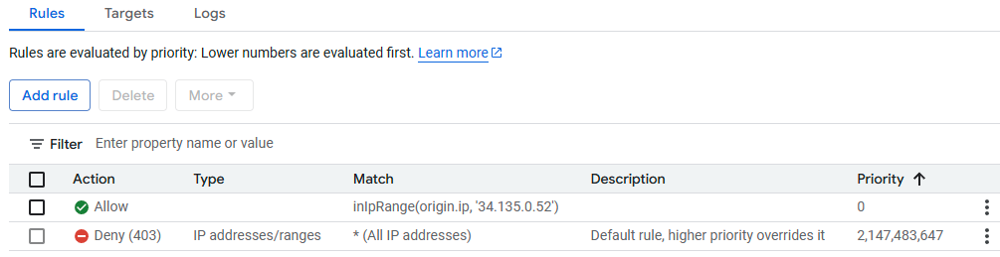
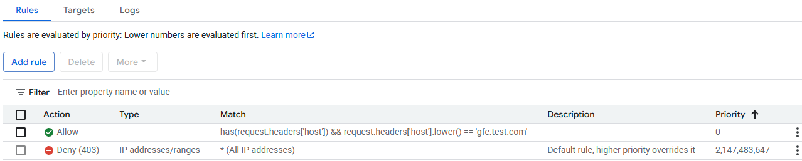
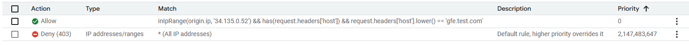
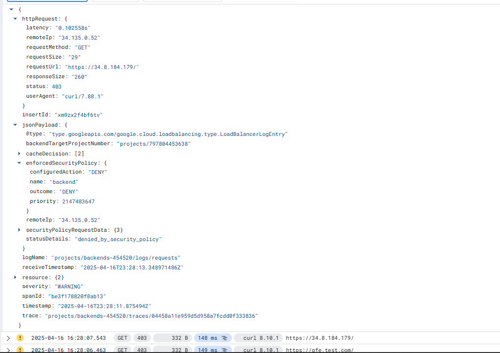
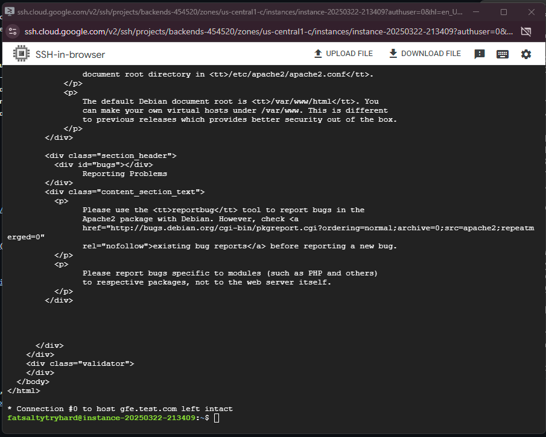
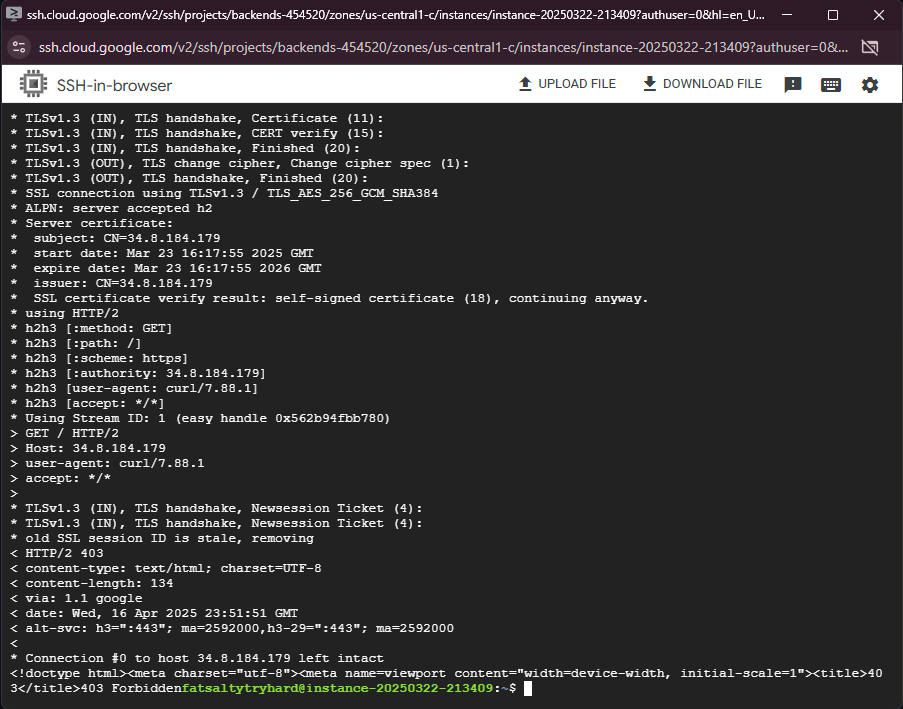

# Cloud armor policy/expression testing: Host header / source IP restrictions.

This document demonstrates the efficacy of gcp cloud armor host filtering/source ip restrictions. The focus is on source ip/host header filtering before traffic enters the network.

> **Note:**  
> - This effort is to prove a concept that host header filtering / source ip filtering is possible on a google external application load balancer.
> - Logging will also be documented for visibility purposes.
> - Cloud NGFW is not in the path of these tests.

| **Curl tests**            | **Curl Command1**                                              | **Result1** | **Curl Command2** | **Result2 |    **NOTES**    |
|-------------------------|---------------------------------------------------------------------------------------------------|------------------------------------------|----------------------------|------------------------------------------------|------------------------------------------------------------------------|
| **Policy with IP restriction (local GCE) but no host header filtering**       |                  curl -kv https://34.8.184.179                   | HTTPS Response from backend server on local consumer GCE. Forbidden from home ip. |       curl -kv https://gfe.test.com, curl -kv https://gfe2.test.com       | HTTPS response from backend server on request to both hostnames resolving to same IP, failed from home with host entries. |         I created two dns entries for the same IP of the load balancer to prove it would work without host filtering. Both curl commands were performed on a local GCE instance.            |
| **Policy with host header filtering but no source restriction** | curl -kv https://34.8.184.179 | Forbidden from home, forbidden from local consumer GCE | curl -kv https://gfe.test.com | successful response for both home ip and local gce instance. | I made both a private and public DNS zone for the LB to be resolvable internally and externally by hostname |
| **Policy with both ip restriction and host header filtering**       | curl -kv https://34.8.184.179                 | Forbidden from home, forbidden from local comsumer GCE | curl -kv https://gfe.test.com | Forbidden from home, allowed from local GCE consumer | This gave the desired effect of whitelisting one IP while being able to control ingress traffic host headers as well. |

---

## IMAGES of policy

- **Test policy 1:**
  

- **Test policy 2:**
  

- **Test policy 3:**  
  

---

## Logging findings

- **Cloud Armor Logs:**
  When a policy is matched/denied, it is displayed in gcp logs explorer as seen below (403 forbidden example)
  

---

## Workload screenshots of failure vs success

- **Success**
  
- **Blocked**
  
  

