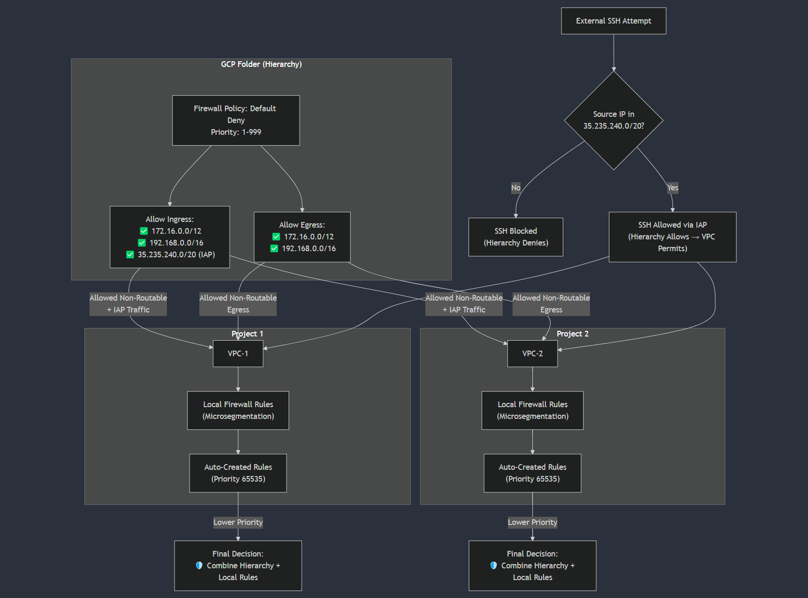
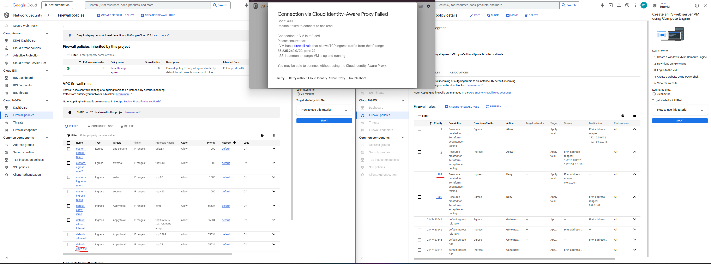
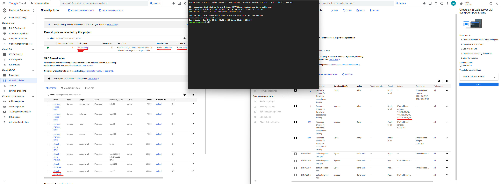

# Proposal: Hierarchical Firewall Rules for GCP to Optimize Terraform Management

## Overview
This document proposes a centralized hierarchical firewall architecture for GCP to replace the existing model of managing thousands of project-level default deny firewall rules. The new design leverages **folder-level firewall policies** to reduce Terraform workspace apply times, and eliminate "rule already exists" errors.

---

## Problem Statement
- **Performance Issues**: Applying rules across thousands of projects causes 40+ minute apply times.
- **State Conflicts**: Frequent "rule already exists" errors due to overlapping project-level rules.
- **Default Rule Exceptions**: Every time a project requires decomm, we have to add the project number to our conditional statement i.g. (NOT PROJECTS: xxxxxxxxx, etc..)
---

## Proposed Solution
Implement **hierarchical firewall policies** at the folder level to:
1. Define default-deny ingress/egress rules globally.
2. Allow only approved traffic via centralized policies.
3. Delegate specific exceptions to local VPC firewall rules.

### Architecture Diagram

## Key Features
| Feature | Description |
|---------|-------------|
| **Centralized Management** | Rules are defined once at the folder level. |
| **Default-Deny Model** | Block all traffic unless explicitly allowed. To entire environment. |
| **CIDR-Driven Delegation** | Pass known non-routable ranges (`172.16.0.0/12`, `192.168.0.0/16`) to local VPC rules. |
| **State Consistency** | Eliminate duplicate rule conflicts through Terraform-managed policies. |

---

## Validation Tests

### Test 1: SSH Block Without IAP Range
- **Hierarchical Policy**: Deny all ingress except `172.16.0.0/12`, `192.168.0.0/16`
- **Local VPC Rule**: Allow SSH from `0.0.0.0/0`
- **Result**: Connection blocked ❌  
 

### Test 2: SSH Success With IAP Range
- **Hierarchical Policy Added**: `35.235.240.0/20` to allowed ingress
- **Result**: SSH via IAP succeeded ✅  
 

---

